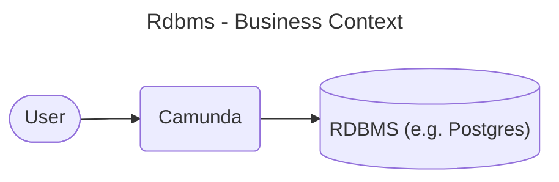
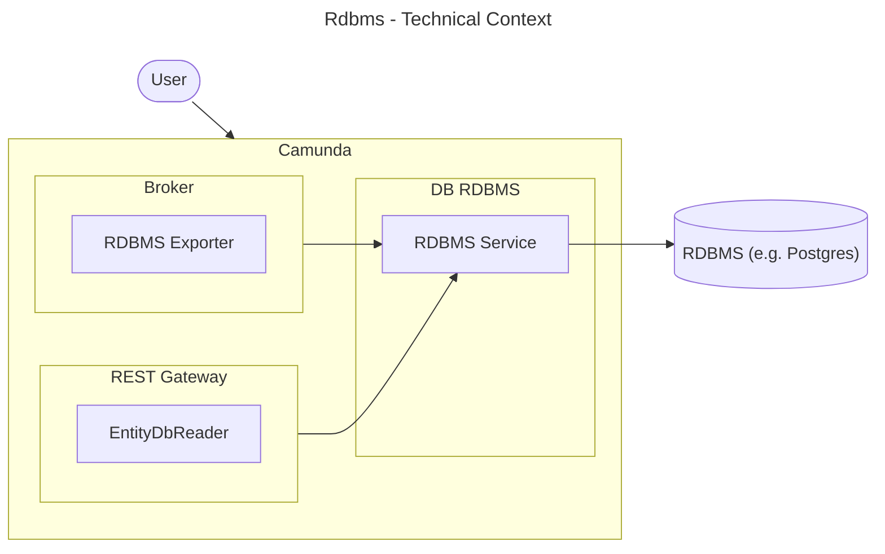
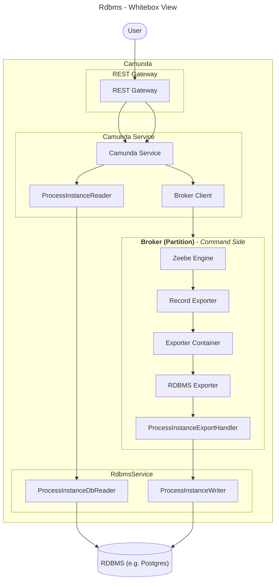
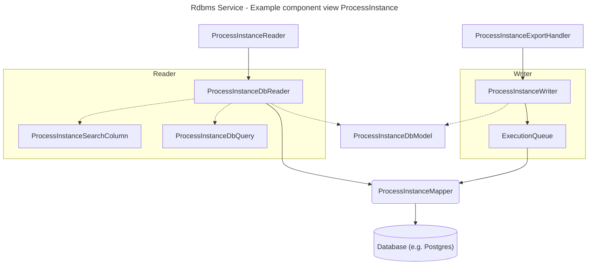

# Architecture Documentation

## 1. Introduction and Goals

This documentation is based on [arc42](https://arc42.org/overview) which is a common architecture
documentation template for software systems. It is structured into several sections that cover
different aspects of the system's architecture, including constraints, system context, solution
strategy, building blocks, and runtime view.

### 1.1 Overview

The RDBMS module adds support to Camunda for relational database management systems (RDBMS) as an
alternative to Elasticsearch (ES) and OpenSearch (OS) for second-level storage.

Key Features & Benefits:

- **Seamless RDBMS Integration**: Supports SQL-based databases, enabling customers to leverage
  existing DBA expertise.
- **Simplified Onboarding & Testing**: Removes the dependency on ES/OS, making it easier to use
  lightweight in-memory databases for local development and testing scenarios.
- **Operational Efficiency**: Facilitates easier maintenance, backups, and upgrades with
  established database procedures.
- **Enterprise Readiness**: Addresses licensing constraints, compliance requirements, and cost
  concerns.

### 1.2 Requirements Overview

- **Provide RDBMS as secondary storage backend** for the Orchestration Cluster as an alternative to
  Elasticsearch/OpenSearch, without changing external API behavior or request/response semantics for
  clients.
- **Support multiple relational databases** (PostgreSQL/Aurora, MariaDB, MySQL, SQL Server, Oracle, H2
  for single-broker) under a documented support policy, including schema management via Liquibase.
- **Persist and expose orchestration data** (process instances, user tasks, etc.) by exporting Zeebe
  records into RDBMS and serving all read access via the Orchestration Cluster (v2 REST API and
  internal readers), not by direct DB access.
- **Support lifecycle operations on RDBMS data**, including automatic history cleanup (TTL-based marking
  plus batch deletion) and consistent backup/restore together with Zeebe log via exporter position
  tracking.
- **Expose configuration options** for connectivity, pooling, TLS, credentials, table prefixing, and
  auto-DDL/manual schema control so that operations teams can integrate with their existing RDBMS
  standards and tooling.

### 1.3 Quality Goals

- **Reliability & consistency:** RDBMS state must stay consistent with Zeebe’s primary log,
  including after failover and restore, using exporter positions and backup ranges to synchronize
  both systems.
- **Performance & scalability:** Typical workloads should meet or closely match existing
  secondary-storage SLAs by using batched exports, configurable flush intervals/queue sizes, and
  tunable JDBC connection pools.
- **Security:** Introducing RDBMS must not weaken the platform’s security posture; it should
  preserve the existing external attack surface, rely on database-layer protections, encourage
  TLS-secured connections, and pass regular security assessments.
- **Operability:** Operators must be able to diagnose and fix RDBMS-related issues efficiently via
  clear logging, documented failure modes, and dedicated troubleshooting guidance for connectivity,
  exporter, and query errors.
- **Maintainability & extensibility:** The RDBMS module should be straightforward to extend (new
  entities/fields, new DB versions) using documented conventions, minimizing regression risk across
  all supported databases.

### 1.4 Stakeholders

- Daniel Meyer
- Maximilian Trumpf
- Roman Smirnov
- Aleksander Dytko

## 2. Constraints

### Spring

Spring IoC (bean declarations via `@Component`, `@Bean`, `@Autowired`, etc.) must not be used
inside the `db/rdbms` module. All component wiring happens in the `dist` module using constructor
injection. The `db/rdbms` module is a plain Java library with no Spring DI dependency; components
are instantiated and wired together from the outside.

The one exception is `LiquibaseSchemaManager`, which extends Liquibase's
`MultiTenantSpringLiquibase` to leverage its schema-migration lifecycle. It carries no Spring bean
annotations and is wired as a Spring bean in `dist`, not inside `db/rdbms` itself.

## 3. Context and Scope

### 3.1 Business Context



| Entity  |                           Description                            |
|---------|------------------------------------------------------------------|
| User    | The user which uses Camunda.                                     |
| Camunda | The whole camunda platform, including broker, webapps, ...       |
| RDBMS   | A relational database like e.g. H2, Postgres, MariaDB or Oracle. |

### 3.2 Technical Context



|     Entity     |                                                                                               Description                                                                                               |
|----------------|---------------------------------------------------------------------------------------------------------------------------------------------------------------------------------------------------------|
| User           | The user which uses Camunda.                                                                                                                                                                            |
| Camunda        | The whole camunda platform, including broker, webapps, ...                                                                                                                                              |
| RDBMS Exporter | An additional exporter like the Camunda Exporter which listens for records from broker and exports them via RDBMS Service into a RDBMS. Only active if there is an configured exporter with id `rdbms`. |
| EntityDbReader | Each entity (processInstance, user, role) has an Reader interface (e.g. ProcessInstanceReader). For each of these interfaces, RDBMS provides a DbReader implementation (e.g. ProcessInstanceDbReader)   |
| RDBMS Service  | Entry Point to the database module which provides readers for the search client as well as writers for the exporter.                                                                                     |
| RDBMS          | A relational database like e.g. H2, Postgres, MariaDB or Oracle.                                                                                                                                        |

## 4. Solution Strategy

- **CQRS**: Like how zeebe in general is working, we also segregate the read and write operations
  for the RDBMS module. We have own services for reading and writing to the database.
- **Exporter creation via Spring**: A new approach to create exporters was introduced while building
  the rdbms module, because the exporter needs access to the spring context. For details, see
  here: https://github.com/camunda/camunda/issues/22446

## 5. Building Block View

### 5.1 Whitebox Overall System



|            Entity            |                                                                                               Description                                                                                               |
|------------------------------|---------------------------------------------------------------------------------------------------------------------------------------------------------------------------------------------------------|
| User                         | The user which uses Camunda.                                                                                                                                                                            |
| REST Gateway                 | The v2 REST API, e.g.: `io.camunda.zeebe.gateway.rest.controller.ProcessInstanceController`                                                                                                             |
| Camunda Service              | A camunda service, e.g.: `io.camunda.service.ProcessInstanceServices`. It uses a either a SearchClient for query data, or the broker client to send commands to zeebe.                                  |
| Broker Client                | Is used to send commands to zeebe.                                                                                                                                                                      |
| Zeebe Engine                 | The engine works on commands and produces the records which are processed later by the exporters.                                                                                                       |
| RDBMS Exporter               | An additional exporter like the Camunda Exporter which listens for records from broker and exports them via RDBMS Service into a RDBMS. Only active if there is an configured exporter with id `rdbms`. |
| ProcessInstanceExportHandler | An example record handler, here for records for processInstances.                                                                                                                                       |
| ProcessInstanceWriter        | Is used by the RDBMS exporter and it's handlers to write processInstance data.                                                                                                                          |
| RDBMS Service                | Entry Point to the database module which provides readers for the search client as well as writers for the exporter.                                                                                     |
| ProcessInstanceReader        | Is the general API interface to read data from the secondary storage (here processInstance as example). Has to be implemented by the secondary storage implementation.                                  |
| ProcessInstanceDbReader      | The RDBMS implementation of the ProcessInstanceReader.                                                                                                                                                  |
| RDBMS                        | A relational database like e.g. H2, Postgres, MariaDB or Oracle.                                                                                                                                        |

### 5.2 Components

#### 5.2.1 Component RdbmsExporter

The `zeebe/exporters/rdbms-exporter` module is the Zeebe broker-side component responsible for
consuming Zeebe records and persisting them to the RDBMS via `RdbmsService`. In contrast to the
`CamundaExporter`, the RDBMS Exporter is created via Spring, because it needs access to the Spring
context to obtain the `RdbmsService` and the `DataSource`.

The module is organised into the following packages under
`io.camunda.exporter.rdbms`:

```
io.camunda.exporter.rdbms
├── RdbmsExporterFactory      — ExporterFactory implementation; creates RdbmsExporterWrapper instances
├── RdbmsExporterWrapper      — Implements the Zeebe Exporter SPI; wires configuration, caches,
│                               handlers, and delegates records to RdbmsExporter
├── RdbmsExporter             — Core exporter; routes records to registered handlers, manages
│                               flush scheduling, history cleanup, and position tracking
├── RdbmsExportHandler        — Handler interface (canExport / export)
├── ExporterConfiguration     — Exporter configuration (flush interval, queue size, cache sizes,
│                               audit log, history deletion)
├── cache/
│   ├── RdbmsProcessCacheLoader             — Caffeine CacheLoader that loads CachedProcessEntity
│   │                                         from RDBMS on cache miss (used for call-activity IDs,
│   │                                         flow node names, user-task flag)
│   ├── RdbmsDecisionRequirementsCacheLoader — CacheLoader for decision requirements metadata
│   └── RdbmsBatchOperationCacheLoader       — CacheLoader for batch operation metadata
├── handlers/
│   ├── AuditLogExportHandler               — Generic handler that wraps an AuditLogTransformer
│   │                                         and writes an AuditLogDbModel for each matching record
│   ├── ProcessInstanceExportHandler        — Handles ELEMENT_ACTIVATING / ELEMENT_COMPLETED /
│   │                                         ELEMENT_TERMINATED / ELEMENT_MIGRATED for processes
│   ├── FlowNodeExportHandler               — Handles flow node instance lifecycle records
│   ├── VariableExportHandler               — Handles variable create/update records
│   ├── UserTaskExportHandler               — Handles user task lifecycle records
│   ├── IncidentExportHandler               — Handles incident create/resolve records
│   ├── JobExportHandler                    — Handles job lifecycle records
│   ├── ProcessExportHandler                — Handles process definition deployment records
│   │                                         (partition 1 only)
│   ├── DecisionDefinitionExportHandler     — Handles decision definition records (partition 1 only)
│   ├── DecisionInstanceExportHandler       — Handles decision evaluation records
│   ├── DecisionRequirementsExportHandler   — Handles DMN requirements records (partition 1 only)
│   ├── FormExportHandler                   — Handles form deployment records (partition 1 only)
│   ├── GroupExportHandler                  — Handles group lifecycle records
│   ├── RoleExportHandler                   — Handles role lifecycle records (partition 1 only)
│   ├── UserExportHandler                   — Handles user lifecycle records (partition 1 only)
│   ├── TenantExportHandler                 — Handles tenant lifecycle records (partition 1 only)
│   ├── MappingRuleExportHandler            — Handles mapping rule records (partition 1 only)
│   ├── AuthorizationExportHandler          — Handles authorization records (partition 1 only)
│   ├── MessageSubscriptionExportHandler    — Handles message subscription records
│   ├── SequenceFlowExportHandler           — Handles sequence flow records
│   ├── UsageMetricExportHandler            — Handles usage metric records
│   ├── GlobalListenerExportHandler         — Handles global listener records
│   ├── HistoryDeletionDeletedHandler       — Handles history deletion records
│   ├── JobMetricsBatchExportHandler        — Handles job metrics batch records
│   └── batchoperation/
│       ├── BatchOperationCreatedExportHandler
│       ├── BatchOperationInitializedExportHandler
│       ├── BatchOperationChunkExportHandler
│       ├── BatchOperationLifecycleManagementExportHandler
│       ├── ProcessInstanceCancellationBatchOperationExportHandler
│       ├── ProcessInstanceMigrationBatchOperationExportHandler
│       ├── ProcessInstanceModificationBatchOperationExportHandler
│       ├── ProcessInstanceHistoryDeletionBatchOperationExportHandler
│       ├── DecisionInstanceHistoryDeletionBatchOperationExportHandler
│       ├── IncidentBatchOperationExportHandler
│       └── RdbmsBatchOperationStatusExportHandler
└── utils/
    ├── DateUtil                — Date/time conversion helpers
    ├── ExportUtil              — General export utilities
    └── TreePath                — Builds the hierarchical call-tree path string for process instances
```

##### Cache

The exporter maintains three in-memory Caffeine caches (backed by RDBMS readers as fallback
loaders) to avoid repeated database lookups for frequently needed read-only data:

| Cache | Key | Value | Purpose |
|---|---|---|---|
| `processCache` | process definition key (Long) | `CachedProcessEntity` | Resolves call-activity IDs and flow node names used by `ProcessInstanceExportHandler`, `FlowNodeExportHandler`, and `UserTaskExportHandler` |
| `decisionRequirementsCache` | decision requirements key (Long) | `CachedDecisionRequirementsEntity` | Resolves decision requirements data used by `DecisionDefinitionExportHandler` |
| `batchOperationCache` | batch operation key (String) | `CachedBatchOperationEntity` | Tracks batch operation type and status for batch operation handlers |

Cache sizes are configurable via `ExporterConfiguration` (`processCache.maxSize`,
`decisionRequirementsCache.maxSize`, `batchOperationCache.maxSize`). Cache hit/miss metrics are
published under the `camunda.rdbms.exporter.cache` namespace.

##### Audit Log

When `auditLog.enabled` is set to `true` in the exporter configuration, the
`RdbmsExporterWrapper` registers an `AuditLogExportHandler` for each `AuditLogTransformer`
provided by `AuditLogTransformerRegistry`. The registry categorises transformers into two groups:

- **All-partition transformers** — run on every broker partition; handle instance-level events
  (process instance creation/cancellation, user task operations, variable changes, job events, etc.)
- **Partition-specific transformers** — run only on partition 1 (`PROCESS_DEFINITION_PARTITION`);
  handle definition and identity-level events (process/decision/form deployments, role/group/tenant
  changes, authorizations, etc.)

Each `AuditLogExportHandler` wraps one transformer and writes an `AuditLogDbModel` entry via
`AuditLogWriter` for every record that the transformer supports.

##### How to Add a New Export Handler

Follow these steps to add support for a new Zeebe record type in the RDBMS exporter.

**Step 1 — Implement `RdbmsExportHandler`**

Create a new handler class in `zeebe/exporters/rdbms-exporter/src/main/java/io/camunda/exporter/rdbms/handlers/`:

```java
public class MyEntityExportHandler implements RdbmsExportHandler<MyEntityRecordValue> {

  private static final Set<MyEntityIntent> EXPORTABLE_INTENTS =
      Set.of(MyEntityIntent.CREATED, MyEntityIntent.UPDATED, MyEntityIntent.DELETED);

  private final MyEntityWriter myEntityWriter;

  public MyEntityExportHandler(final MyEntityWriter myEntityWriter) {
    this.myEntityWriter = myEntityWriter;
  }

  @Override
  public boolean canExport(final Record<MyEntityRecordValue> record) {
    return record.getIntent() instanceof final MyEntityIntent intent
        && EXPORTABLE_INTENTS.contains(intent);
  }

  @Override
  public void export(final Record<MyEntityRecordValue> record) {
    final MyEntityRecordValue value = record.getValue();
    switch (record.getIntent()) {
      case MyEntityIntent.CREATED -> myEntityWriter.create(map(value));
      case MyEntityIntent.UPDATED -> myEntityWriter.update(map(value));
      case MyEntityIntent.DELETED -> myEntityWriter.delete(value.getEntityId());
      default -> LOG.warn("Unexpected intent {} for my entity record", record.getIntent());
    }
  }

  private MyEntityDbModel map(final MyEntityRecordValue value) {
    return new MyEntityDbModel.Builder()
        .entityKey(value.getEntityKey())
        .name(value.getName())
        // ... other fields
        .build();
  }
}
```

**Step 2 — Register the handler in `RdbmsExporterWrapper`**

Add a `builder.withHandler(...)` call in the `createHandlers` method (or
`createBatchOperationHandlers` for batch-operation-related handlers):

```java
builder.withHandler(
    ValueType.MY_ENTITY,
    new MyEntityExportHandler(rdbmsWriters.getMyEntityWriter()));
```

If the handler should only run on partition 1 (e.g. for definition-level data that is deployed once
globally), place the `withHandler` call inside the `if (partitionId == PROCESS_DEFINITION_PARTITION)`
block.

**Step 3 — Add audit log support (optional)**

If the new entity should generate audit log entries, create an `AuditLogTransformer` in
`zeebe/exporter-common/src/main/java/io/camunda/zeebe/exporter/common/auditlog/transformers/`:

```java
public class MyEntityAuditLogTransformer implements AuditLogTransformer<MyEntityRecordValue> {

  private static final TransformerConfig CONFIG =
      TransformerConfig.with(ValueType.MY_ENTITY)
          .withIntents(MyEntityIntent.CREATED, MyEntityIntent.UPDATED, MyEntityIntent.DELETED);

  @Override
  public TransformerConfig config() {
    return CONFIG;
  }

  @Override
  public void transform(final Record<MyEntityRecordValue> record, final AuditLogEntry log) {
    final MyEntityRecordValue value = record.getValue();
    log.setEntityKey(value.getEntityKey());
    log.setEntityDescription(value.getName());
    // set any additional audit log fields as needed
  }
}
```

Then register the transformer in `AuditLogTransformerRegistry`. Add a supplier to
`getSourcePartitionTransformerSuppliers()` for definition-level entities, or to
`getAllPartitionTransformerSuppliers()` for instance-level entities:

```java
// In AuditLogTransformerRegistry.getSourcePartitionTransformerSuppliers():
MyEntityAuditLogTransformer::new,
```

No further changes are needed — `RdbmsExporterWrapper.registerAuditLogHandlers()` automatically
creates an `AuditLogExportHandler` for every transformer returned by the registry.

#### 5.2.2 Component RdbmsService

The RdbmsService is the entry point to the rdbms module. It provides readers for the search client
as well as writers for the exporter.



##### Database Domain Models

Every entity (e.g. processInstance, user, role) has different domain objects (example by
`ProcessInstance`):

- **ProcessInstanceDbModel**: The database domain model which represents the database table
  structure.
- **ProcessInstanceDbQuery**: The database query object which is used to build the SQL. It contains
  the filter criteria for the SQL query, sort and pagination options and authorization criteria.
- **ProcessInstanceSearchColumn**: The database search column enum which maps the API properties to
  database column names.

##### Readers

Every entity (e.g. processInstance, user, role) has a Reader interface (e.g.
`ProcessInstanceReader`). For each of these interfaces, RDBMS provides a DbReader implementation
(e.g. `ProcessInstanceDbReader`).

Each entity reader does the same following steps to retrieve the data:

- converts the sort options from the API properties list to database column list
- convert the pagination options from the API pagination object to database pagination object
- transform the API query object (e.g. `ProcessInstanceQuery`) to a database query object
  (e.g. `ProcessInstanceDbQuery`). This is needed to optimize the query datastructures for the use
  in MyBatis
- query the database via MyBatis mappers
- (optional): map the database domain models to API domain models — in most cases this is not
  needed, because the query result mapping already targets the API domain models

##### Writers

Every entity (e.g. processInstance, user, role) has a Writer service class (e.g.
`ProcessInstanceWriter`). The writer is used by the exporter handlers (e.g.
`ProcessInstanceExportHandler`) to write the data to the database. The writers provide dedicated
and specialised methods for the different create or update operations and map these operations to
one or more SQL statements. The writers never use the MyBatis mapper files directly but always use
the `ExecutionQueue` to enqueue the statements.

##### ExecutionQueue

MyBatis statements are not executed immediately, but are queued up in the `ExecutionQueue` and
executed in a batch. This is done to improve performance and reduce the number of database
round-trips. The `ExecutionQueue` is flushed either when it reaches a certain size or when the
exporter flushes the batch manually (usually after a certain amount of time).

###### Database Optimisations in the ExecutionQueue

- **JDBC batching**: The `ExecutionQueue` uses JDBC batching to group multiple SQL statements into
  a single batch, which is then sent to the database in one go. This reduces the number of
  round-trips to the database and improves performance.
- **QueueItem merge**: If there are multiple operations on the same entity (e.g. multiple updates
  to the same process instance), the `ExecutionQueue` merges these operations into a single
  operation. For example, if there are two updates to the same process instance, the
  `ExecutionQueue` will merge them into a single update operation that contains the latest state
  of the process instance. This must be done manually by the calling writer components.

##### History Cleanup Service

The history cleanup service is responsible to clean up old data from the database based on the
configured retention period. The service runs periodically and deletes data that is older than the
retention period. The cleanup is done in batches to avoid long-running transactions and to minimize
the impact on database performance.

Every relevant database object has a `historyCleanupDate` column. To schedule some data for
cleanup, this date has to be set to the respective date this record should be deleted. The
`HistoryCleanupService` then deletes all records which have a `historyCleanupDate` older than the
current date.

Most objects are marked for history cleanup when their process instance is finished (completed or
canceled). BatchOperation objects are an exception to that, they are marked when the batch is
finished.

#### 5.2.3 Component Liquibase & MyBatis

##### Database-Specific Configurations

RDBMS supports multiple database vendors. Each has its own SQL dialect, specific features and
other limitations which have to be considered. To handle these differences, RDBMS uses
database-specific configurations for both MyBatis and Liquibase. These configurations are located
in the `resources/db/vendor-properties/` folder of the `db/rdbms-schema` module. These
configurations cover:

- Syntax configurations, especially for pagination
- Data type limitations, especially for varchar lengths and boolean types
- Foreign key behavior

These properties are loaded and available in all Liquibase scripts as well as in MyBatis mappers
via `${db.vendor.property}` placeholders.

## 9. Architecture Decisions

See the [ADRs](./adr/) for detailed architecture decision records:

- [ADR-0001: Use MyBatis as the ORM Framework for the RDBMS Module](./adr/0001-use-mybatis-as-orm-framework.md)
- [ADR-0002: Use Liquibase for Database Schema Management](./adr/0002-use-liquibase-for-schema-management.md)

## 12. Glossary

| Term           | Definition                                                                              |
|----------------|-----------------------------------------------------------------------------------------|
| RDBMS          | Relational Database Management System (e.g. H2, Postgres, MariaDB, Oracle)             |
| ES             | Elasticsearch — search and analytics engine used as Camunda secondary storage           |
| OS             | OpenSearch — open-source search and analytics engine used as Camunda secondary storage  |
| CQRS           | Command Query Responsibility Segregation — separates read and write operations          |
| ORM            | Object-Relational Mapping — technique for mapping objects to relational database tables |
| MyBatis        | SQL mapping framework used as the ORM layer in the RDBMS module                        |
| Liquibase      | Database schema change management tool used in the RDBMS module                        |
| ExecutionQueue | Internal queue that batches SQL statements before sending them to the database          |
